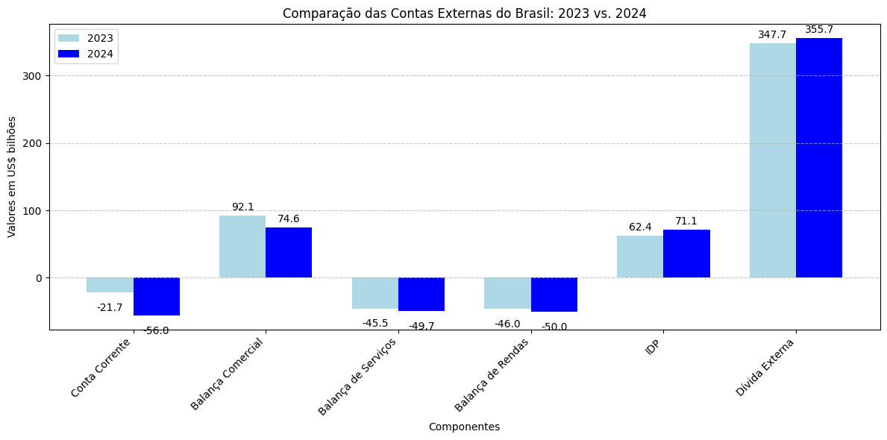

# Contas Externas do Brasil - 2024: Uma Análise Detalhada

As Contas Externas de um país registram todas as transações econômicas entre esse país e o resto do mundo. Elas são essenciais para entender a saúde econômica de uma nação, sua relação com a economia global e sua sustentabilidade a longo prazo. No caso do Brasil em 2024, os principais destaques mostram um quadro misto com superávit comercial, mas déficit em conta corrente.

<!-- more -->

## Principais Componentes das Contas Externas

### Déficit em Conta Corrente: US$ 56 bilhões (2,55% do PIB)

- A Conta Corrente é a soma do balanço comercial (exportações menos importações de bens e serviços), da balança de rendas (lucros, juros e dividendos enviados ou recebidos do exterior) e das transferências correntes (doações e remessas).
- Um déficit na Conta Corrente significa que o Brasil está gastando mais com o exterior do que está recebendo, necessitando de financiamento externo para cobrir essa diferença.
- No caso de 2024, o déficit de US$ 56 bilhões representa 2,55% do Produto Interno Bruto (PIB), indicando a proporção desse déficit em relação à produção total da economia brasileira.

### Superávit Comercial: US$ 74,6 bilhões

- O Superávit Comercial ocorre quando o valor das exportações de bens e serviços é maior do que o valor das importações.
- Em 2024, o Brasil apresentou um superávit comercial de US$ 74,6 bilhões, o que é um ponto positivo, indicando que o país vendeu mais para o exterior do que comprou.

### Déficit em Serviços: US$ 49,7 bilhões

- A Balança de Serviços registra as transações de serviços entre o Brasil e o exterior, como turismo, transporte, seguros, serviços financeiros e outros.
- Um déficit nessa balança significa que o Brasil gastou mais com a compra de serviços do exterior do que ganhou com a venda de serviços para outros países.
- O déficit de US$ 49,7 bilhões em 2024 indica que o país é um importador líquido de serviços.

### Déficit em Rendas: US$ 50 bilhões

- A Balança de Rendas contabiliza os pagamentos e recebimentos de rendas de capital (lucros, juros, dividendos) e renda do trabalho (salários) entre o Brasil e o exterior.
- Um déficit nessa balança, como o de US$ 50 bilhões em 2024, sugere que o Brasil pagou mais rendimentos ao exterior do que recebeu, refletindo, por exemplo, o pagamento de lucros de empresas multinacionais e juros da dívida externa.

### Investimento Direto no País (IDP): US$ 71,1 bilhões

- O Investimento Direto no País (IDP) representa os investimentos de longo prazo que estrangeiros fazem no Brasil, com o objetivo de controlar ou influenciar a gestão das empresas.
- Em 2024, o IDP totalizou US$ 71,1 bilhões, um aumento de 13,7% em relação a 2023. Esse valor é o maior desde 2022, quando atingiu US$ 74,6 bilhões.
- O IDP é crucial para a economia brasileira, pois financia o déficit em conta corrente, traz tecnologia, gera empregos e aumenta a produtividade.
- O saldo do IDP em 2024 corresponde a 3,24% do PIB. Em 2023, o IDP foi de US$ 62,4 bilhões, representando 2,85% do PIB.
- O IDP se destaca pela sua estabilidade em comparação com outros tipos de financiamento externo, como investimentos em carteira e empréstimos, que são mais suscetíveis a choques externos.
- Os setores que mais receberam IDP no Brasil foram serviços financeiros, comércio e extração de petróleo e gás natural.
- Empresas com capital estrangeiro desempenham um papel importante no comércio exterior brasileiro, sendo responsáveis por quase metade das exportações e importações de bens.
- A autoridade monetária calcula mensalmente os dados na conta externa.
- O investimento direto mostra o saldo da entrada e saída de capital voltado a ganhos de longo prazo na economia real, como na área de negócios, empresas, aberturas de filiais multinacionais e obras de infraestrutura.

### Dívida Externa: US$ 355,7 bilhões

- A Dívida Externa é o total de empréstimos e financiamentos que o país deve a credores estrangeiros.
- Em 2024, a dívida externa do Brasil atingiu US$ 355,7 bilhões. É importante analisar a composição e os prazos dessa dívida para avaliar a capacidade do país de honrar seus compromissos.

## Comparação das Contas Externas: 2023 vs. 2024

{ width=900px height=700px }

## Principais Exportações e Importações do Brasil

### Exportações:
- Soja (Principais destinos: China, União Europeia)
- Minério de Ferro (China, Japão)
- Petróleo e Derivados (Estados Unidos, China)
- Carnes: Frango, Bovina, Suína (China, Hong Kong, União Europeia)
- Café (Estados Unidos, União Europeia)

### Importações:
- Máquinas e Equipamentos (China, Estados Unidos, Alemanha)
- Autopeças e Veículos (Argentina, Alemanha, Japão)
- Produtos Eletrônicos (China, Estados Unidos, México)
- Químicos e Fertilizantes (China, Estados Unidos)
- Petróleo e Derivados (Estados Unidos, China)

## Considerações Finais

As Contas Externas do Brasil em 2024 apresentam um quadro misto. O superávit comercial é um ponto forte, mas o déficit em conta corrente, financiado em grande parte pelo IDP, requer atenção. O IDP desempenha um papel fundamental na economia brasileira, trazendo recursos para o país, mas é essencial que o Brasil mantenha um ambiente econômico estável e seguro para atrair e manter esses investimentos a longo prazo.

Para manter e ampliar esses benefícios, é essencial que o país preserve a estabilidade macroeconômica, a segurança jurídica e políticas que incentivem o investimento de longo prazo.

## Apresentação: resumo

  <iframe src="https://docs.google.com/presentation/d/e/2PACX-1vRCra1Faw-PSw4JAB9dQPzQrQdeZSD5eHbVqAh1IOQEk_nfJj4uW4RcW9QcyA5raUuLCWqQgetJZFKg/pubembed?start=false&loop=true&delayms=3000" frameborder="0" width="960" height="569" allowfullscreen="true" mozallowfullscreen="true" webkitallowfullscreen="true"></iframe>

