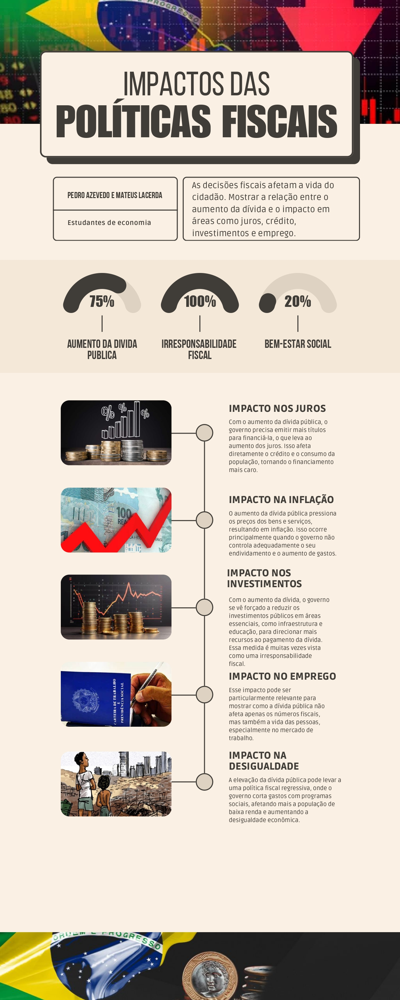

# A Pólvora Fiscal: Impactos e Consequências

A pólvora fiscal é um termo utilizado para descrever medidas econômicas de curto prazo que geram alívio imediato, mas podem comprometer a saúde financeira do país no longo prazo. Essas medidas, como subsídios, isenções fiscais e programas de transferência de renda sem planejamento adequado, podem criar um cenário de instabilidade econômica.

<!-- more -->

## O Que é a Pólvora Fiscal?

A pólvora fiscal refere-se a medidas econômicas adotadas pelo governo para estimular a economia no curto prazo, mas que podem comprometer a sustentabilidade fiscal no longo prazo. Essas medidas incluem:

- Isenções fiscais para setores específicos
- Subsídios para produtos e serviços
- Programas de transferência de renda sem planejamento financeiro adequado
- Redução de impostos sem compensação orçamentária

Essas políticas são frequentemente adotadas em momentos de crise econômica ou em períodos eleitorais, visando ganhar popularidade, mas sem uma fonte de planejamento financeiro. Essas medidas populares acabam sendo um peso para as contas públicas, já que o governo não tem capacidade de manter esses gastos de forma fixa.

## O Custo da Pólvora Fiscal

Embora as políticas de subsídios e isenções sejam eficazes no curto prazo, o problema é que o governo não consegue financiar seus custos no longo prazo. Ao alimentar a bomba fiscal com essas medidas, o governo compromete o futuro da nação.

Quando o governo reduz impostos ou concede subsídios sem ter uma fonte de financiamento, ele cria um problema nas contas públicas. Esse déficit fiscal precisa ser pago, onde geralmente é pago com mais endividamento. Como resultado, a dívida pública cresce, e o país precisa gastar cada vez mais para pagar os juros dessa dívida.

Além disso, a utilização de medidas emergenciais contribui para a perda de credibilidade fiscal. O mercado e os investidores começam a perceber que o governo não está adotando uma política fiscal supervisionada. Com isso aumentando o risco do país, elevando os custos e aumentando as chances de se criar uma crise econômica.

Esse processo pode criar um ciclo vicioso: o governo aumenta a dívida para cobrir o déficit, o risco-país cresce, e a inflação começa a subir, afetando o poder de compra da população.

## Exemplos da Pólvora Fiscal no Brasil

Nos últimos anos, o Brasil tem adotado diversas medidas de pólvora fiscal:

O desconto da folha de pagamento que ocorreu entre 2011-2023 foi uma das principais políticas adotadas para estimular a economia. Mesmo que tenha tido um ótimo reconhecimento pelo setor da empresa, a medida não foi pensada ao longo prazo. A renúncia fiscal gerada por essas isenções não foi compensada por um aumento da arrecadação de tributos, com isso gerou um déficit fiscal.

Em 2022 no governo Bolsonaro adotou a PEC Kamikaze alimentou mais uma vez a teoria da pólvora fiscal. Uma ação que aumentou os benefícios do Auxílio Brasil e concedeu subsídios para combustíveis e transporte público, visando garantir apoio político em um ano eleitoral. Embora tenha beneficiado a população no curto prazo, a PEC não teve uma fonte de financiamento financeiro e resultou mais uma vez em um aumento do déficit fiscal.

## Os Impactos da Pólvora Fiscal

A pólvora fiscal tem grande participação nos impactos na economia. O primeiro é o aumento da dívida pública. O governo se endivida para cobrir o déficit causado pelas isenções fiscais e pelos subsídios, o que aumenta o peso da dívida no futuro. Como consequência, o país precisa gastar mais para pagar os juros da dívida, reduzindo o orçamento em áreas como saúde, educação e infraestrutura.

Também temos o impacto da inflação que é um dos principais efeitos negativos da pólvora fiscal. Quando o governo gasta mais sem ter como financiar, a demanda por produtos e serviços aumenta, mas a oferta não acompanha. Isso faz os preços subirem, prejudicando o poder de compra, especialmente dos mais pobres.

Outro impacto é a perda de confiança do mercado na área fiscal. Com o uso recorrente de políticas fiscais emergenciais faz com que o mercado perceba que o governo não tem um bom plano fiscal. Podendo aumentar o risco do país, trazendo um ambiente no mercado brasileiro mais instável e dificultando o acesso a financiamentos no exterior.

## A Necessidade de Apagar a Bomba

A pólvora fiscal pode trazer alívio imediato, mas seus custos a longo prazo são altos. O governo precisa adotar um melhor planejamento fiscal, com medidas que não dependam de isenções e subsídios sem uma fonte de financiamento financeiro definida. A dívida pública deve ser controlada para garantir que o país tenha condições de investir em áreas essenciais para a população.

O Brasil precisa de reformas estruturais que promovam a estabilidade fiscal e econômica no longo prazo. O uso contínuo de pólvora fiscal apenas adia o problema, deixando a bomba fiscal cada vez mais próxima de explodir.

{ width=600px height=500px }

## Referências

- Risco fiscal: "É um cenário bastante desafiador e com o governo dando sinais ambíguos", afirma economista da FGV – Money Times
- Relatório Banco Central do Brasil - 202502_Texto_de_estatisticas_fiscais.pdf
- Carta do IBRE, Documento FGV - 12ce2024cartadoibre.pdf
- Fiscal é principal risco à estabilidade, diz mercado - Folha de São Paulo
- Gasto público e risco fiscal | Blog do IBRE - FGV
- Campos Neto: Realidade fiscal do Brasil não é "desastre iminente" - Poder 360
- Risco fiscal pode chegar a R$ 430 bilhões em 2023, segundo Ibre, da FGV | CNN Brasil
- Trading Economics - Evolução da dívida pública brasileira de 2011 a 2022
- Carta de Conjuntura - IPEA
- Governo Central registra déficit primário de R$ 9,283 bilhões em julho, aponta Tesouro Nacional — Ministério da Fazenda
