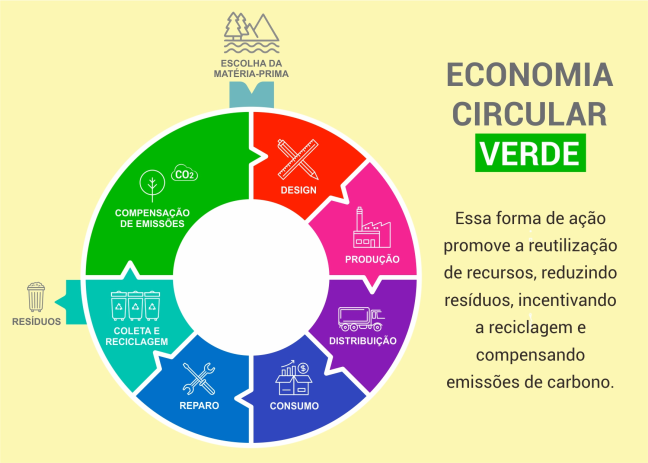
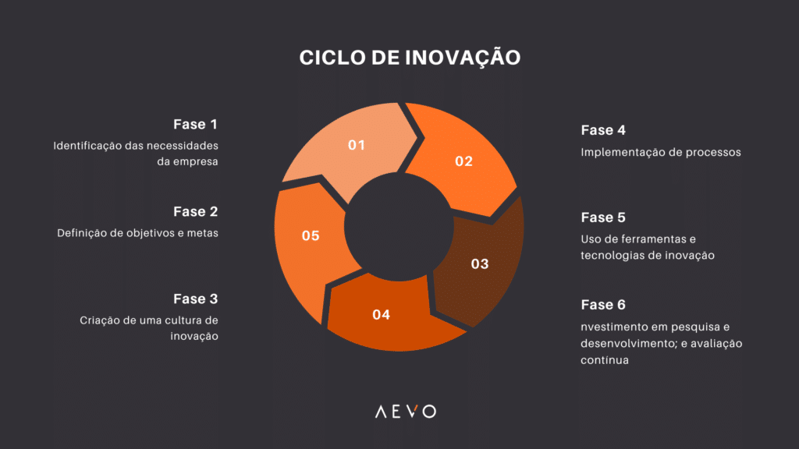
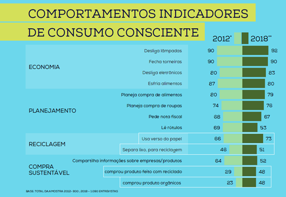

# Economia Circular e Tecnologia: Caminhos para um Consumo Sustentável

Em um mundo marcado pelo rápido avanço da tecnologia e altos níveis de consumo, é necessário repensar os comportamentos de produção, utilização e descarte de recursos, que aumentam o desperdício e o impacto ambiental.  

A **economia circular** surge como uma alternativa ao modelo linear tradicional, ao concentrar-se na **reutilização, reciclagem e gestão inteligente de recursos**.  

Com a ajuda das novas tecnologias, essas práticas estão mudando a forma de produção e o comportamento dos consumidores — mostrando que é possível unir desenvolvimento, bem-estar e sustentabilidade no dia a dia.

<!-- more -->

## O que é a economia circular?

A economia circular é um modelo econômico que busca **fechar o ciclo de vida dos produtos**, promovendo o uso eficiente dos recursos e a redução dos impactos ambientais.  

Em vez de descartar materiais após o uso, ela incentiva a **reutilização, a reciclagem e o compartilhamento**.  
Baseia-se em três princípios fundamentais:

1. Eliminar o desperdício e a poluição;  
2. Manter materiais em uso pelo maior tempo possível;  
3. Regenerar os sistemas naturais.

Dessa forma, o valor dos recursos é preservado e a dependência de matérias-primas virgens diminui.  
A economia circular já se faz presente em diversas práticas cotidianas — como o uso de **embalagens retornáveis, separação e reciclagem de resíduos, consumo consciente e reaproveitamento de materiais**.

{ width=900px height=700px }
Fonte: FIOCRUZ (2020)
---

## Inovações tecnológicas como motor da circularidade

As **inovações tecnológicas** vêm se consolidando como elementos centrais para a transição rumo a uma economia verdadeiramente circular.  

Diferente do modelo linear tradicional — baseado em **extrair, produzir, consumir e descartar** — a circularidade busca prolongar o ciclo de vida dos produtos e minimizar o desperdício.

Entre os principais avanços estão:

- **Materiais inteligentes e biodegradáveis**, capazes de se decompor rapidamente ou serem reutilizados em novos ciclos produtivos;  
- **Plataformas digitais** que estimulam o consumo colaborativo (compartilhamento de bicicletas, roupas, carros e eletrônicos);  
- **Internet das Coisas (IoT)** e **Inteligência Artificial (IA)** aplicadas ao monitoramento de cadeias produtivas, otimizando o uso de insumos e reduzindo falhas.

Mais do que promover uma mudança técnica, essas inovações impulsionam uma **transformação cultural**.  
A tecnologia torna-se não apenas um meio de “produzir de outro jeito”, mas um **instrumento para incentivar comportamentos conscientes e colaborativos**, unindo inovação e sustentabilidade.

{ width=900px height=700px }
Fonte: ECOOAR (2022)
---

## Do consumismo ao consumo inteligente

A economia circular está diretamente ligada à **transição do consumismo para o consumo inteligente**.  
Enquanto o consumismo se baseia em comprar, usar e descartar rapidamente, a economia circular propõe uma nova lógica de **durabilidade, reaproveitamento e redução do desperdício**.

### Quando a tecnologia reforça o consumismo
- Influenciadores digitais e tendências de redes sociais que incentivam compras impulsivas;  
- Satisfação psicológica associada ao ato de comprar;  
- Lançamentos frequentes de produtos tecnológicos que estimulam o desejo de atualização constante (como novos modelos de smartphones).

### Quando a tecnologia promove o consumo inteligente
- Aplicativos que mostram a **pegada ecológica de produtos**;  
- Plataformas de **revenda e aluguel**, que ampliam a vida útil dos bens;  
- Ferramentas que promovem **transparência sobre origem e impacto ambiental** dos produtos.

Assim, o consumo deixa de ser guiado apenas pelo desejo de possuir e passa a ser **mais consciente e funcional** — orientado pela necessidade real e pela responsabilidade ambiental.

{ width=900px height=700px }
Fonte: AEVO (2023)
---

## Conclusão

A transformação para uma sociedade mais sustentável depende de uma **mudança profunda na forma como produzimos, consumimos e descartamos**.  

A economia circular surge como uma alternativa essencial ao modelo linear, ao reduzir o desperdício e valorizar os recursos naturais.

Com o apoio das inovações tecnológicas, esse modelo torna-se cada vez mais viável — otimizando processos produtivos, desenvolvendo materiais sustentáveis e incentivando práticas como **reciclagem, compartilhamento e consumo consciente**.

A adoção de atitudes simples — como **reduzir o uso de energia, valorizar produtos reciclados e usar transporte coletivo** — pode gerar impacto significativo.  

Somadas aos avanços tecnológicos e à conscientização coletiva, essas práticas mostram que é possível **unir progresso, inovação e preservação ambiental**.

Somente assim construiremos um futuro em que **desenvolvimento e sustentabilidade caminhem lado a lado**, garantindo qualidade de vida para as próximas gerações.

---

## Referências

- ACCENTURE. *Waste to Wealth: Creating Advantage in a Circular Economy.* New York: Palgrave Macmillan, 2015.  
- AEVO. *Ciclos de inovação: o que são, etapas e como aplicá-los nas empresas.* Disponível em: [https://blog.aevo.com.br/ciclos-de-inovacao](https://blog.aevo.com.br/ciclos-de-inovacao).  
- BRASIL. Ministério da Fazenda. *Economia Circular.* Disponível em: [https://www.gov.br/fazenda/.../economia-circular](https://www.gov.br/fazenda/pt-br/acesso-a-informacao/acoes-e-programas/transformacao-ecologica/transformacao-ecologica-pagina-antiga/economia-circular).  
- ECOOAR. *Economia circular: verde é o futuro sustentável.* Disponível em: [https://blog.ecooar.com/economia-circular-verde-e-o-futuro-sustentavel](https://blog.ecooar.com/economia-circular-verde-e-o-futuro-sustentavel).  
- FUNDAÇÃO OSWALDO CRUZ (FIOCRUZ). *Dia do Consumo Consciente.* Disponível em: [https://www.cogic.fiocruz.br/2020/10/15-de-outubro-dia-do-consumo-consciente](https://www.cogic.fiocruz.br/2020/10/15-de-outubro-dia-do-consumo-consciente).  
- PAQUET, Renato. *Economia Circular: o que é e quais seus benefícios?* Disponível em: [https://www.creditodelogisticareversa.com.br/post/t-economia-circular-o-que-e-e-quais-seus-beneficios](https://www.creditodelogisticareversa.com.br/post/t-economia-circular-o-que-e-e-quais-seus-beneficios).  
- PNUMA – Programa das Nações Unidas para o Meio Ambiente. *Global Waste Management Outlook.* Nairobi: UNEP, 2015.  
- UNINTER. *Tecnologia é aliada na prática do consumo sustentável.* Disponível em: [https://www.uninter.com/noticias/tecnologia-e-aliada-na-pratica-do-consumo-sustentavel](https://www.uninter.com/noticias/tecnologia-e-aliada-na-pratica-do-consumo-sustentavel).  
