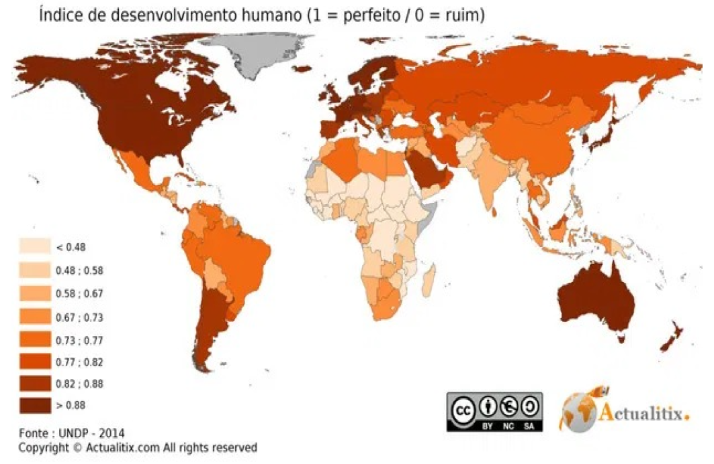
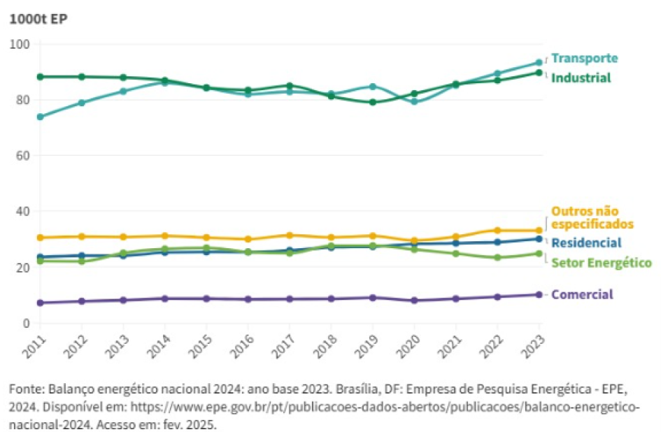
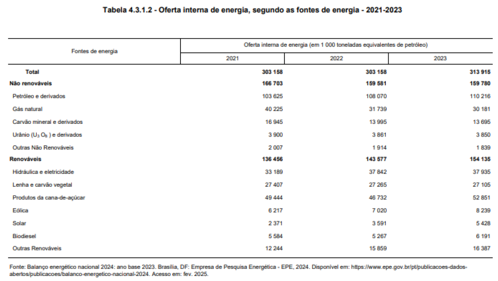

# Energia elétrica: conforto ou pressão sobre o planeta?

O **Índice de Desenvolvimento Humano (IDH)** mede a qualidade de vida das pessoas a partir de três dimensões: **renda, educação e longevidade**.  

Em 2023, o Brasil alcançou **0,786 de IDH**, ocupando a 84ª posição mundial segundo o *Programa das Nações Unidas para o Desenvolvimento (PNUD, 2024)*.  

No entanto, o crescimento do IDH vem acompanhado de um **aumento no consumo de energia elétrica**, o que representa uma **pressão planetária** — ou seja, um impacto direto sobre os recursos naturais e o equilíbrio ambiental.  

<!-- more -->

O **IDH Ajustado às Pressões Planetárias (IDHM-AP)** é uma metodologia recente que avalia o desenvolvimento humano considerando também o impacto ambiental.  

De acordo com essa abordagem, o consumo de energia está diretamente ligado às **emissões de CO₂** e ao **uso intensivo de recursos naturais**, mostrando como o conforto cotidiano pode aumentar a pressão sobre o planeta.

{ width=900px height=700px }
{ width=900px height=700px }

---

## Exemplo do cotidiano

Em casa, é comum **deixarmos luzes acesas em cômodos vazios**, **o ar-condicionado ligado por horas** ou **aparelhos conectados na tomada mesmo sem uso**.  

Esses hábitos, repetidos por milhões de pessoas, elevam significativamente a demanda energética do país.

Segundo dados da **Empresa de Pesquisa Energética (EPE, 2024)**, o **consumo residencial deve crescer em média 3,3% ao ano até 2035**, chegando a **254 TWh**, o que representa cerca de **27% do consumo total nacional**.

Além disso, com a popularização dos **carros elétricos** — que passaram de 1,9 mil unidades em 2020 para mais de **215 mil em 2024** — a demanda por energia cresce ainda mais (*Ministério de Minas e Energia, 2024*).

{ width=900px height=700px }

---

## Reflexão

O aumento do consumo de energia é um **reflexo do desenvolvimento humano**: buscamos conforto, tecnologia e bem-estar.  
Mas, sem planejamento, isso **intensifica as mudanças climáticas** e **pressiona os ecossistemas**.  

De acordo com o *Relatório de Desenvolvimento Humano 2024 (PNUD)*, o avanço econômico e social precisa ser acompanhado por **políticas sustentáveis**, para que o planeta consiga suportar o ritmo de crescimento humano.

---

## Sugestão positiva

Cada pessoa pode contribuir para equilibrar **desenvolvimento e sustentabilidade**.  

Algumas atitudes simples ajudam a **reduzir o impacto ambiental**:

- Trocar **lâmpadas comuns por LEDs**, que consomem até 80% menos energia;  
- **Desligar aparelhos da tomada** quando não estiverem em uso;  
- Aproveitar melhor a **luz natural** durante o dia;  
- **Investir em energia solar residencial**, fonte limpa e renovável que já representa mais de **71% da matriz energética residencial brasileira (MME, 2024)**.

Essas ações reduzem o consumo, preservam o meio ambiente e permitem que o **desenvolvimento humano ocorra de forma verdadeiramente sustentável**.

---

## Referências

- **CEON.** *Energia - Anuário Estatístico do Brasil.* IBGE, 2024.  
  Disponível em: [https://anuario.ibge.gov.br/2024/industria/energia.html](https://anuario.ibge.gov.br/2024/industria/energia.html)  
- **EPE & MME.** *Consumo de eletricidade no Brasil deve crescer em média 3,3% ao ano até 2035.*  
  Disponível em: [https://www.epe.gov.br/...](https://www.epe.gov.br/pt/imprensa/noticias/consumo-de-eletricidade-no-brasil-deve-crescer-em-media-3-3-ao-ano-ate-2035-indica-estudo-do-mme-e-da-epe)  
- **Agência Brasil.** *Brasil sobe cinco posições no ranking do IDH e está na 84ª colocação.*  
  Disponível em: [https://agenciabrasil.ebc.com.br/economia/noticia/2025-05/brasil-sobe-cinco-posicoes-no-ranking-do-idh-e-esta-na-84a-colocacao](https://agenciabrasil.ebc.com.br/economia/noticia/2025-05/brasil-sobe-cinco-posicoes-no-ranking-do-idh-e-esta-na-84a-colocacao)  
- **ONU.** *Objetivos de Desenvolvimento Sustentável (ODS).*  
  Disponível em: [https://brasil.un.org/pt-br/sdgs](https://brasil.un.org/pt-br/sdgs)  
- **PNUD.** *Relatório de Desenvolvimento Humano 2024.*  
  Disponível em: [https://hdr.undp.org](https://hdr.undp.org)  
- **MME.** *Uso de energia limpa cresce nas residências do Brasil.*  
  Disponível em: [https://www.gov.br/mme/pt-br/assuntos/noticias/uso-de-energia-limpa-cresce-nas-residencias-do-brasil](https://www.gov.br/mme/pt-br/assuntos/noticias/uso-de-energia-limpa-cresce-nas-residencias-do-brasil)  
