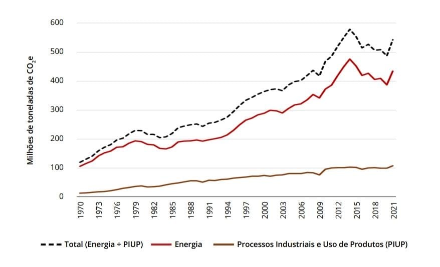
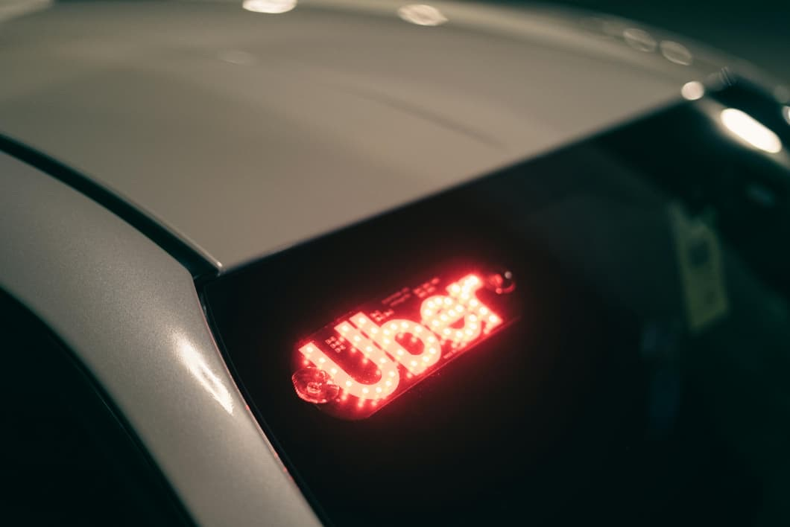

# Transporte por Aplicativo e Sustentabilidade: Uma Análise das Pressões Planetárias

O **aumento do transporte por aplicativo**, impulsionado por plataformas como Uber, 99 e outros serviços de mobilidade urbana, transformou a forma como as pessoas se deslocam nas cidades.  

No entanto, esse crescimento acelerado tem consequências diretas sobre o **consumo de energia** e as **emissões de gases de efeito estufa (GEE)**, contribuindo para as chamadas **pressões planetárias**.

De acordo com dados do *Sistema de Estimativas de Emissões de Gases de Efeito Estufa (SEEG, 2023)*, as emissões totais de CO₂ do setor energético brasileiro cresceram significativamente nas últimas décadas.  

<!-- more -->

O gráfico abaixo mostra a evolução dessas emissões entre 1970 e 2021.

{ width=900px height=700px }

## Impacto do transporte urbano nas emissões

A expansão do transporte por aplicativo trouxe **benefícios de acessibilidade e conveniência**, mas também **aumentou o número de veículos circulando nas cidades**.  

Estudos mostram que parte considerável dos motoristas que aderem a essas plataformas não substituem o transporte público, mas **aumentam o número total de quilômetros rodados** — elevando o consumo de combustíveis fósseis.

Além disso, o **tempo ocioso dos veículos em busca de passageiros** e os **retornos vazios** contribuem para o aumento das emissões.  

Segundo a Agência Internacional de Energia (IEA, 2022), o transporte urbano responde por **mais de 25% das emissões globais de CO₂ relacionadas à energia**.

{ width=900px height=700px }

---

## Tecnologia e eficiência energética

O avanço da tecnologia pode, por outro lado, **contribuir para a redução dos impactos ambientais**.  

Algumas iniciativas estão em curso:

- Incentivo ao uso de **veículos elétricos e híbridos** nas frotas de transporte por aplicativo;  
- Desenvolvimento de **algoritmos de roteamento inteligente**, reduzindo distâncias percorridas sem passageiros;  
- Integração entre **aplicativos e transporte público**, promovendo soluções multimodais e mais sustentáveis.

Essas medidas buscam diminuir as **emissões por quilômetro rodado** e melhorar a **eficiência energética** do setor.  

No entanto, sua adoção ainda é desigual, especialmente em países em desenvolvimento.

{ width=900px height=700px }

---

## Conexão entre transporte e pressões planetárias

As **pressões planetárias** referem-se aos impactos ambientais decorrentes das atividades humanas — especialmente aquelas que afetam o **clima, a biodiversidade e os recursos naturais**.  

O aumento das emissões de gases de efeito estufa está diretamente ligado à intensificação dessas pressões, contribuindo para fenômenos como **aquecimento global, desmatamento e queimadas**.

No contexto brasileiro, o transporte urbano intensivo em combustíveis fósseis contribui não apenas para as emissões de CO₂, mas também para a **expansão das fronteiras agrícolas e da infraestrutura viária**, que pressionam ecossistemas sensíveis, como o Cerrado e a Amazônia.

{ width=900px height=700px }

---

## Caminhos para um transporte sustentável

Para alinhar o transporte por aplicativo aos objetivos de sustentabilidade e aos **limites planetários**, é necessário:

- Ampliar o uso de **energias renováveis** na matriz veicular;  
- Estimular a **compartilhamento de viagens (carpooling)**;  
- Integrar os aplicativos com **redes de transporte público**;  
- Incentivar políticas de **mobilidade urbana sustentável** e redução do tráfego individual;  
- Criar metas de **neutralização de carbono** para empresas do setor.

Essas ações podem reduzir as emissões, melhorar a qualidade do ar nas cidades e contribuir para um desenvolvimento humano que respeite os **limites ecológicos do planeta**.

---

## Conclusão

O transporte por aplicativo representa um avanço na forma de mobilidade urbana, mas também traz desafios para a sustentabilidade.  
Enquanto proporciona praticidade e inclusão social, amplia as emissões e pressões sobre os recursos naturais.  

A transição para um **modelo de transporte mais verde e eficiente** depende do compromisso de empresas, governos e consumidores.  
Com inovação tecnológica, planejamento urbano e consciência ambiental, é possível **reduzir as pressões planetárias** e garantir cidades mais equilibradas e sustentáveis.

---

## Referências

- SEEG – *Sistema de Estimativas de Emissões de Gases de Efeito Estufa (2023).* Disponível em: [https://seeg.eco.br](https://seeg.eco.br)  
- IEA – *World Energy Outlook 2022.* Paris: International Energy Agency, 2022.  
- PNUMA – *Emissions Gap Report 2023.* Nairobi: United Nations Environment Programme.  
- UBER. *Relatório de Sustentabilidade 2024.* Disponível em: [https://www.uber.com](https://www.uber.com)  
- BRASIL. *Plano Nacional de Mobilidade Urbana Sustentável.* Ministério das Cidades, 2024.  
