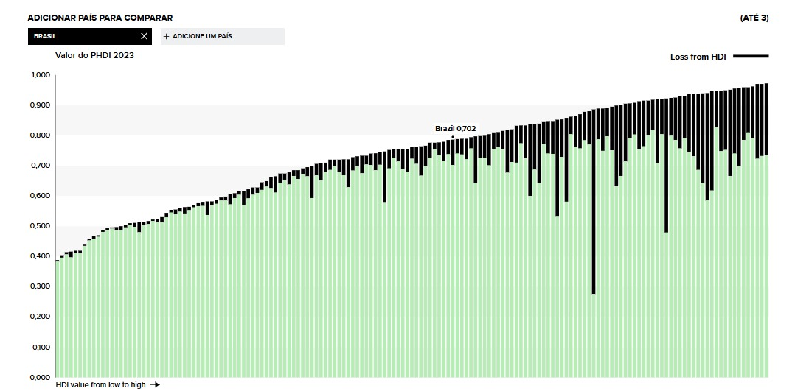
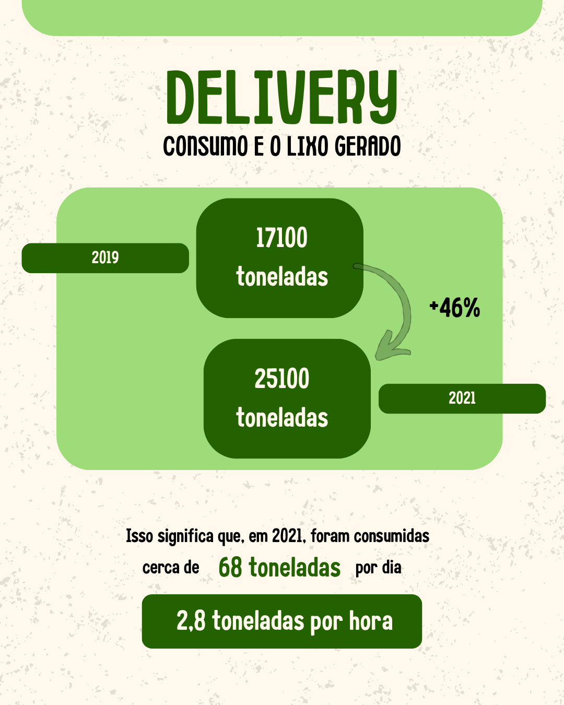
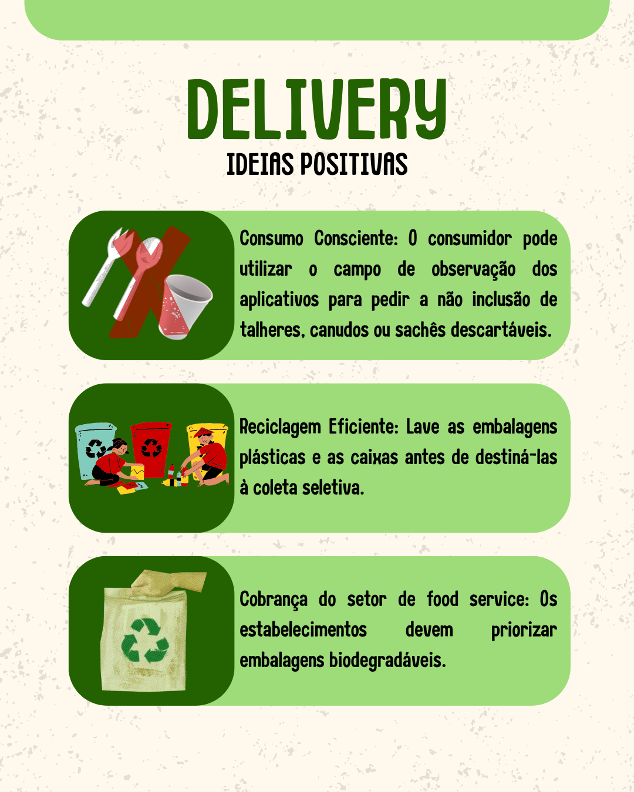

# O delivery do fim de semana e as embalagens que sobram

O conforto de pedir comida por delivery nos fins de semana é inegável, mas o alto volume de embalagens descartadas tem um impacto direto no desenvolvimento humano.  

O custo desse consumo é refletido no **IDH Ajustado às Pressões Planetárias (IDHM-AP)**, um índice que mostra como o progresso humano precisa considerar os limites ambientais.

<!-- more -->

## O desenvolvimento humano e as pressões planetárias

O **IDH**, criado pelo *PNUD* em 1990, mede o progresso de uma nação com base em três dimensões: **saúde, educação e renda**.  

Porém, ele não considera os **impactos ambientais** que acompanham o crescimento econômico.  

Assim, surge o **IDHM-AP**, que ajusta o desenvolvimento humano de acordo com as **emissões de CO₂** e a **pegada material** — dois indicadores das pressões exercidas sobre o planeta.

{ width=900px height=700px }

---

## O delivery e o lixo

A conveniência do delivery se tornou parte da rotina urbana.  

Porém, o aumento do consumo vem acompanhado de **um crescimento preocupante na geração de resíduos**.  

Durante a pandemia, o uso de **plásticos descartáveis** em pedidos de comida aumentou **46% entre 2019 e 2021**, segundo a Oceana (2022).  

Grande parte desses materiais — como **sacolas, potes e talheres plásticos** — não é reciclada.

{ width=900px height=700px }

---

## Como o IDHM-AP mede essas pressões

O índice ajusta o valor do IDH conforme o impacto ambiental, usando dois componentes principais:

- **Índice de Emissões de CO₂ per capita:** mede o quanto as atividades econômicas e o consumo de energia contribuem para o aquecimento global.  
- **Índice de Pegada Material per capita:** avalia o volume de recursos naturais extraídos e consumidos pela sociedade.

A alta produção de **embalagens plásticas descartáveis** no Brasil — cerca de **2,95 milhões de toneladas por ano** — contribui diretamente para a queda do IDHM-AP, já que reflete um modelo de consumo insustentável.

---

## Consequências e ideias positivas

Ignorar essas pressões gera custos ambientais e sociais a longo prazo.  

A poluição e o acúmulo de resíduos comprometem a **saúde humana**, aumentam os **gastos públicos** e reduzem o bem-estar.

Por outro lado, há **soluções práticas** que podem reduzir esse impacto:

- **Consumo consciente:** pedir para não incluir talheres e sachês nos aplicativos.  
- **Reciclagem eficiente:** lavar e separar embalagens antes da coleta seletiva.  
- **Responsabilidade empresarial:** incentivar o uso de **embalagens biodegradáveis** e **materiais compostáveis**.  

Essas ações reduzem a pegada ambiental e contribuem para um **IDHM-AP mais equilibrado**.

{ width=900px height=700px }

---

## Referências

- PNUD. *Planetary Pressures–Adjusted Human Development Index.* Disponível em: [https://hdr.undp.org/planetary-pressures-adjusted-human-development-index#/indicies/PHDI](https://hdr.undp.org/planetary-pressures-adjusted-human-development-index#/indicies/PHDI)  
- ATLAS DO DESENVOLVIMENTO HUMANO NO BRASIL. *Perfil.* Disponível em: [http://www.atlasbrasil.org.br/perfil](http://www.atlasbrasil.org.br/perfil)  
- OCÉANA. *O mercado de delivery de refeições e a poluição plástica.* 2022.  
- ABIA. *Setor de food service vive momento de recuperação após pandemia.* Disponível em: [https://www.abia.org.br/releases](https://www.abia.org.br/releases)  
