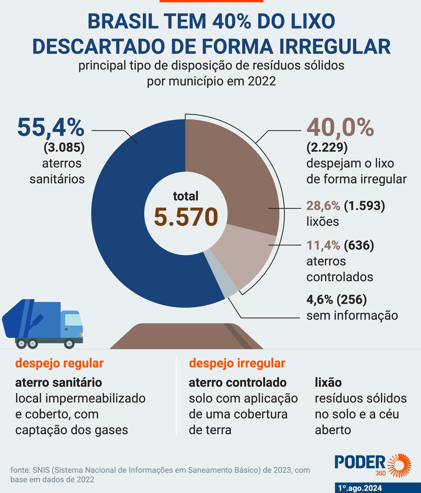
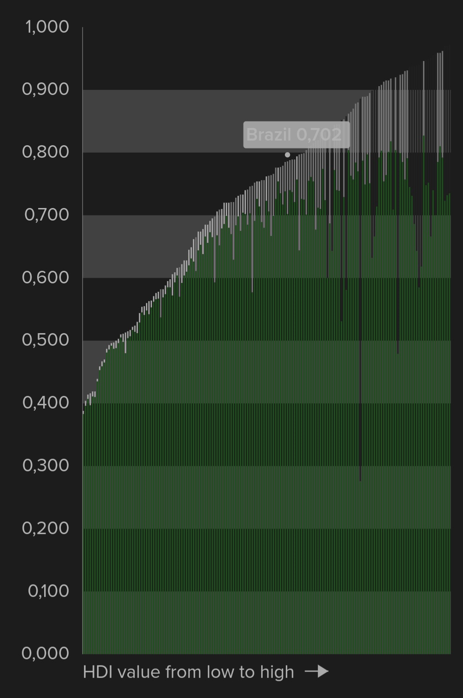
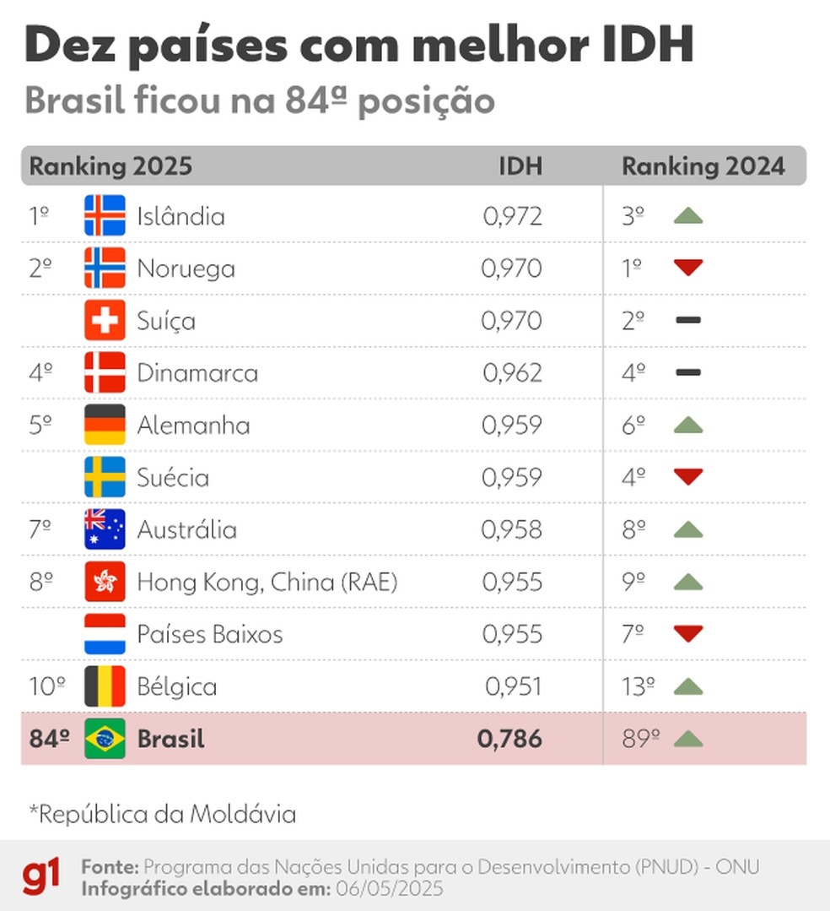

# Os impactos do descarte incorreto de lixos e a reciclagem ineficiente

O **Índice de Desenvolvimento Humano (IDH)** é um dos principais indicadores de bem-estar social, considerando **renda, educação e saúde**. 

Porém, o **IDH ajustado às pressões ambientais (IDHp)** traz uma nova dimensão, ao incorporar os **impactos ecológicos** do desenvolvimento humano.

<!-- more -->

## O desafio do lixo urbano

No Brasil, **82 milhões de toneladas de resíduos** são geradas anualmente, segundo a **ABRELPE (2022)**.  
Deste total, menos de **4% é reciclado corretamente**, e cerca de **40% é descartado de forma irregular**, acumulando-se em **ruas, rios e lixões**.

Esses dados revelam uma falha estrutural na gestão de resíduos sólidos, com efeitos diretos sobre o **meio ambiente, a saúde pública e o desenvolvimento humano**.

{ width=900px height=700px }

---

## Situações cotidianas que agravam o problema

Imagine jogar uma **garrafa plástica com restos de líquido** no mesmo saco em que estão restos de comida. 

Esse é um erro comum que **contamina o material reciclável**, tornando impossível sua reutilização. 

O lixo misturado vai parar em **aterros ou lixões**, aumentando as emissões e poluindo o solo e a água.

{ width=900px height=700px }

---

## Reflexões e consequências

O baixo índice de reciclagem e o descarte incorreto de lixo revelam **falta de conscientização e infraestrutura**.  

A poluição gerada reduz os recursos naturais e afeta diretamente a **qualidade de vida**.  

Esse cenário impacta o **IDHp**, demonstrando que o desenvolvimento humano sem sustentabilidade **não é completo**.

{ width=900px height=700px }

---

## Referências

- ABRELPE. *Índice de Reciclagem no Brasil é de 4%.* 2022.  
- PODER360. *Brasil tem 40% do lixo descartado de forma inadequada.* 2024.  
- AGÊNCIA BRASIL. *Brasil sobe 5 posições no ranking global de desenvolvimento humano.* 2025.  
- ONU. *O que é o IDH.* Disponível em: [https://www.undp.org/pt/brazil/o-que-e-o-idh](https://www.undp.org/pt/brazil/o-que-e-o-idh)  
- PNUD. *Planetary Pressures–Adjusted Human Development Index.* Disponível em: [https://hdr.undp.org/planetary-pressures-adjusted-human-development-index#/indicies/PHDI](https://hdr.undp.org/planetary-pressures-adjusted-human-development-index#/indicies/PHDI)  
